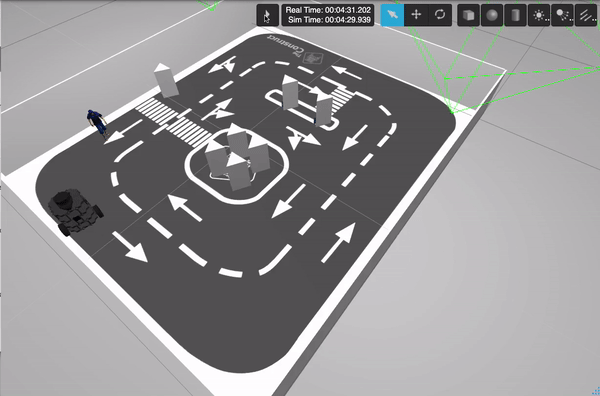

# ROS2 Basics in 5 Days Final Project

## Main Goal

The project consists of three main sections: developing a wall-following behavior using ROS topics, creating a service for automatic wall alignment, and implementing an action server for odometry recording. The robot will find the closest wall, align itself with it, start recording odometry, follow the wall, and stop when it has completed and entire lap. Firstly, i've implemented it and tested it in the Gazebo simulator and then on the real robot. 

## Youtube demo

